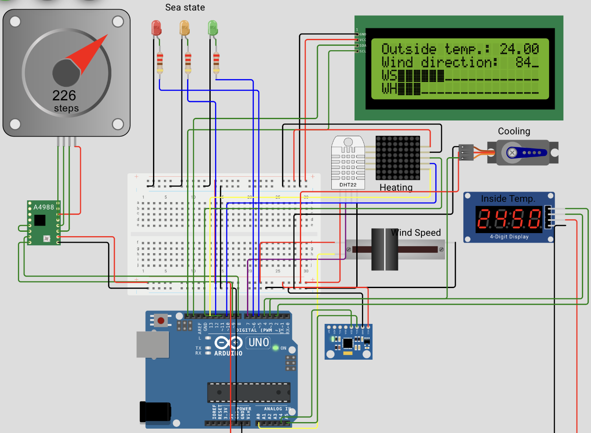
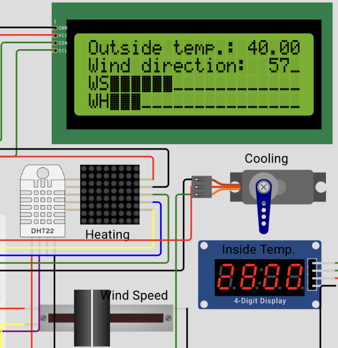
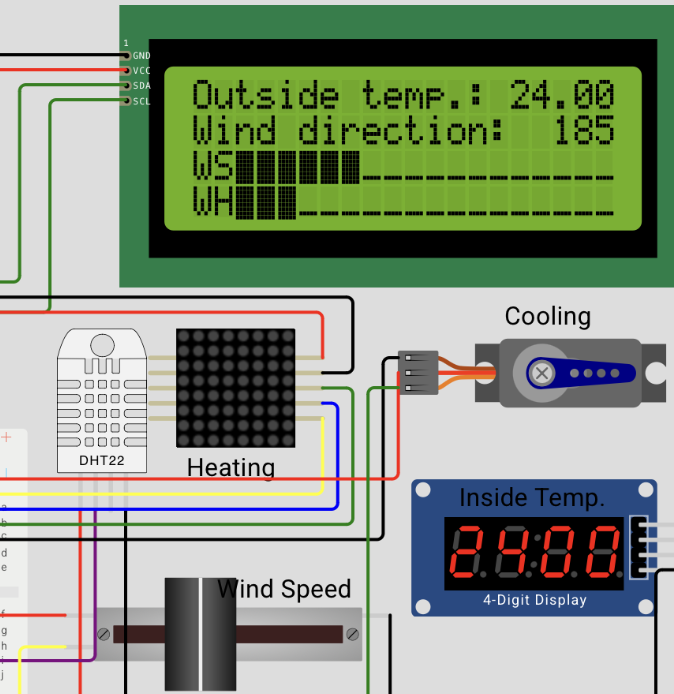

# Actividad 2 - Boya climática
En esta actividad se ha utilizado el dispositivo programado en la Actividad 1, el cual simula una boya marina, y se ha ampliado su funcionalidad. En concreto, se ha añadido un algoritmo de control de la temperatura interior para mantenerla a una determinada temperatura de consigna con un margen de +/- 3ºC.
El dispositivo mejorado puede verse en este enlace al [proyecto Wokwi](https://wokwi.com/projects/432228479492520961)

## Repaso de la funcionalidad implementada en la Actividad 1
En la primera actividad habíamos implementado la siguiente funcionalidad en el dispositivo:
* Un sensor de temperatura y humedad (DHT22)
* Un anemómetro (simulado) proporcionaba la dirección y velocidad del viento en cada momento. La dirección se generaba de forma aleatoria y la velocidad manualmente a través de un slider.
* Un acelerómetro para medir la altura de ola.
* Una pantalla LCD para mostrar en tiempo real la medición de temperatura, dirección y velocidad del viento y altura de ola.

## Elementos añadidos al dispositivo respecto a la Actividad 1
Al objeto de implementar la nueva funcionalidad requerida en esta segunda actividad, se han añadido los siguientes elmentos al prototipo:
- Un display de 4 dígitos para mostrar la temperatura interior con dos cifras decimales.
- Un LED de 8x8 puntos tipo MAX7219 que simula la activación del sistema de calefacción.
- Un motor servo con una palanca que simula la activación del sistema de refrigeración.

El montaje final queda como se muestra en la imagen.




## Funcionamiento del algoritmo de control
Dado que el sensor de temperatura DHT22 disponible en Wokwi tiene que manipularse manualmente, se opta por distinguir entre una temperatura exterior (tempExterior), la del ambiente, que es medida por el sensor, y una temperatura interior (tempInterior) del recinto donde se alojan las baterías. De manera natural, la temperatura interior tendería a aproximarse a la temperatura exterior. Esto se simula incrementando o decrementando la temperatura interior según la temperatura exterior y lo hace a una velocidad de 0.5ºC cada 500ms. Sin intervención de sistema de climatización, la temperatura interior tiende a igualarse a la exterior, lo cual se simula con este código:
```
 if (tempInterior > temperature){
    tempInterior = tempInterior - 0.5;
  } else {
    tempInterior = tempInterior + 0.5;
  }
```
Para el funcionamiento del sistema de climatización, se establece una temperatura de consigna (tempConsigna) de 25ºC y un margen (tempMargin) de +/- 3ºC. Además, el sistema tiene dos modos de funcionamiento, similar a los equipos de climatización reales, un modo calefacción (en invierno) y un modo refrigeración (en verano). Por ejemplo, una bomba de calor de aerotermia puede funcionar en ambos modos pero necesita una válvula 4 vías para cambiar el ciclo que hace el refrigerante según el caso ([cómo funciona una bomba de calor](https://learn.apolloheatpumps.com/es/como-funciona-una-bomba-de-calor/))
Para simular esto, el código activa el modo invierno o el modo verano dependiendo de la temperatura exterior en relación a la temperatura de consigna.
```
if (tempExterior<tempConsigna){
    winter=true;
    summer=false;
    myservo.write(90); 
  } else{
    winter=false;
    summer=true;
    mx.clear();
  }
```
Por otro lado, para evitar la conexión y desconexión continua del sistema a la temperatura de consigna, establecemos el arranque de la calefacción cuando la temperatura baja por debajo de (tempConsigna-tempMargin) y el arranque de la refriferación cuando la temperatura sube por encima de (tempConsigna+tempMargin). Por tanto, existe un rango de temperatura de +/- 3ºC alrededor de la temperatura de consigna (llamado rango muerto) en el cual no se activa ni la calefacción ni la refrigeración. Esto es lógico, porque es un rango de temperatura aceptable y no hace falta gastar energía en el sistema de climatización.
```
if ((tempInterior<(tempConsigna-tempMargin))&&winter){
    for(int x = 0; x < 8 ; x++){
    for(int y = 0; y < 8 ; y++){
      mx.setPoint(y, x, true);
      mx.update();
    }
  }
    tempInterior = tempInterior + 1.0;
  }
  if (tempInterior>(tempConsigna+tempMargin)){
    mx.clear();
  }
  if ((tempInterior>(tempConsigna+tempMargin))&&summer){
    myservo.write(180);
    tempInterior = tempInterior - 1.0;
  }
  if (tempInterior<(tempConsigna-tempMargin)){
   myservo.write(90); 
  }
```
Como se observa en el código anterior, se asume que el rendimiento del equipo de calefación (refrigeración) es de +1ºC (-1ºC) cada 500ms. La activación del modo calefacción se representa en el dispositivo mediante el LED 8x8 (mx) y la refrigeracion mediante la palanca adosada al servomotor (myservo).

## Tests de prueba
Realizamos un test del dispositivo probando los siguientes casos:
### Caso 1 - Temperatura exterior menor a la temperatura de consigna
Establecemos una temperatura exterior de 9ºC, la cual está por debajo de la temperatura de consigna (25ºC), lo cual activa el flag "winter". La temperatura interior comienza a bajar aproximándose a la temperatura exterior. Sin embargo, cuando llega a los 22ºC (25ºC-3ºC) se activa la calefacción, la cual impide que baje más la temperatura.


### Caso 2 - Temperatura exterior mayor a la temperatura de consigna
Establecemos una temperatura exterior de 40ºC, la cual está por encima de la temperatura de consigna (25ºC), lo cual activa el flag "summer". La temperatura interior comienza a subir aproximándose a la temperatura exterior. Sin embargo, cuando llega a los 28ºC (25ºC+3ºC) se activa la refrigeración (ver palanca del servomotor), la cual impide que suba más la temperatura.



### Caso 3 - Temperatura exterior dentro del rango admisible
Establecemos una temperatura exterior de 24ºC, la cual queda dentro del rango admisible. En este caso no se activa ni la calefaccion ni la refrigeración.




